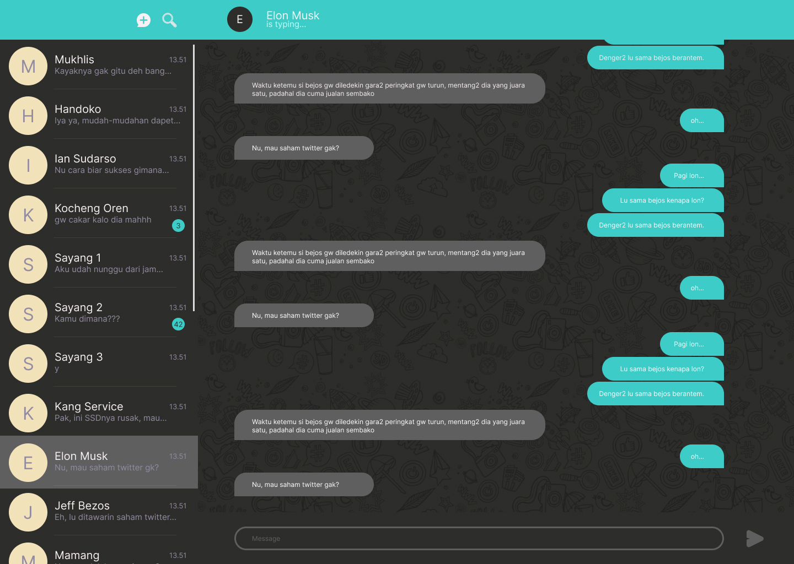
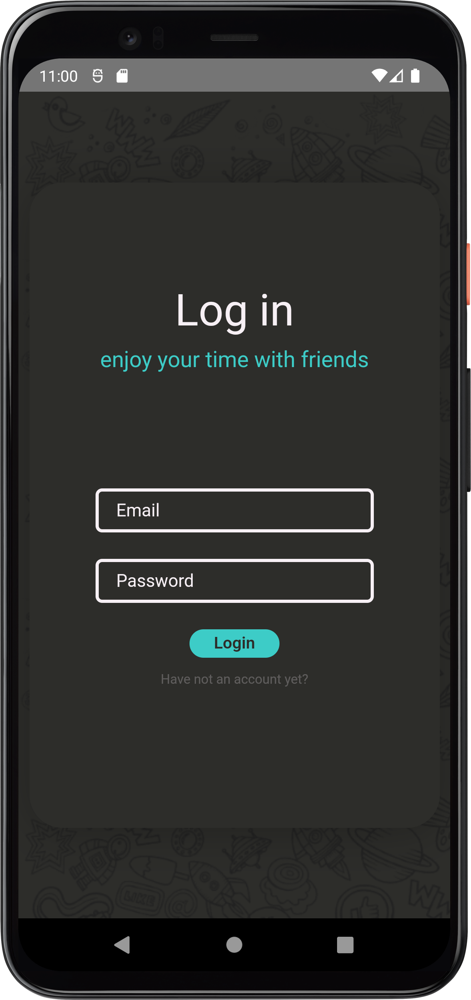

# Netmin (Chatting App)

This project was made by react js.

## Here is the demo
Visit link [here](https://netmin.netlify.app/). And get the apk [here](./android/app/release) or go to android/app/release folder and download the app-release.apk

So, this is just a chat app like the other chat app, but it's more simple (just 2 way communication).
These are the result:

**Website**

**Mobile**
